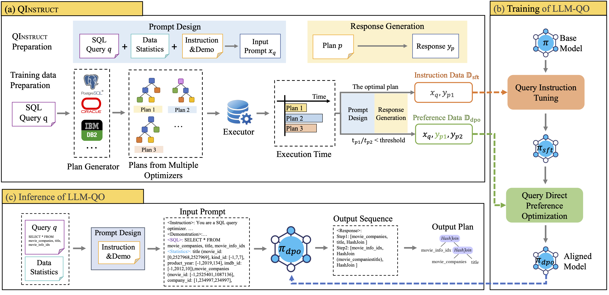

**Can Large Language Models Be Query Optimizer for Relational Databases?**
----------
# Contents
- [Overview](#overview)
- [Installation](#installation)
- [Datasets](#datasets)
- [Training and inference](#training-and-inference)


## Overview 
Query optimization, which finds the optimized execution plan for a given query, is a complex planning and decision-making problem within the exponentially growing plan space in database management systems (DBMS). Traditional optimizers heavily rely on a certain cost model constructed by various heuristics and empirical tuning, probably leading to generating suboptimal plans. Recent developments of Large Language Models (LLMs) have demonstrated their potential in solving complex planning and decision-making problems, such as arithmetic and programmatic tasks. In this paper, we try to explore the potential of LLMs in handling query optimization and propose a tentative LLM-based query optimizer dubbed LLM-QO, established on PostgreSQL’s execution engine. In LLM-QO, we formulate query optimization in an autoregressive fashion which directly generates the execution plan without explicit plan enumeration. To investigate the essential input of LLM-QO , we design a customized data recipe named QInstruct to collect the training data from various optimizers and serialize the database’s meta data, queries and corresponding plans into a textual format. Based on QInstruct, we implement a two-stage fine-tuning pipeline, Query Instruction Tuning (Qit) and Query Direct Preference Optimization (Qdpo), to empower the capability of general-purpose LLMs in handling query optimization. In our experiments, LLM-QO can generate valid and high-quality plans and consistently outperforms both traditional and learned optimizers on three query workloads. Our findings verify that LLMs can be derived as query optimizers where generalization, efficiency and adaptivity deserve further research efforts.


<div align="center">
  
  
  Overview
</div>

## Run LLM-QO

### Installation

#### Requirements
 - PostgreSQL: PostgreSQL 12.4, https://github.com/ossc-db/pg_hint_plan/tree/PG12

 - pg_hint_plan: Version1.3.10, https://github.com/ossc-db/pg_hint_plan

 - Python: Python>=3.11, conda is recommended

#### Environment creation

```bash
conda create --name unsloth_env \
    python=3.11 \
    pytorch-cuda=12.1 \
    pytorch cudatoolkit xformers -c pytorch -c nvidia -c xformers \
    -y
conda activate unsloth_env

pip install "unsloth[colab-new] @ git+https://github.com/unslothai/unsloth.git"
pip install --no-deps trl peft accelerate bitsandbytes
```

### Datasets

We use these 3 datasets in our work:

 - IMDB: https://dataverse.harvard.edu/dataset.xhtml?persistentId=doi:10.7910/DVN/2QYZBT
 - JOB_light: https://github.com/andreaskipf/learnedcardinalities/blob/master/workloads/job-light.sql
 - DSB: https://github.com/microsoft/dsb

We have preprocessed the DSB dataset and make it ready to be used in training and inference. You can find it in `./data` directory.

### Training and inference

#### Training
To perform the two-stage training, please use the script
```bash
 cd ./scripts
 bash ./train_qit.sh 
 ```
 for the QIT training stage, the model checkpoints will be saved in a directory like './scripts/outputs_dsb/SFT_data_meta_final.dsb.mixed.train.one_shot_CoT_llama3-8b-2025-01-01/checkpoint-600'. The date part '2025-01-01' depends on when you run the script, and you could also find different checkpoints produced at different training steps. We use '600' as an example here.
 
 To start the QDPO stage training, you need to provide a model checkpoint from the QIT training stage and set the <CKPT_PATH> to the following script
```bash
 cd ./scripts
 # bash ./train_qdpo.sh \
 #   ./scripts/outputs_dsb/SFT_data_meta_final.dsb.mixed.train.one_shot_CoT_llama3-8b-2025-01-01/checkpoint-600
 bash ./train_qdpo.sh <CKPT_PATH> 
 ``` 

#### Inference
 The parameter <TRAIN_RUN_NAME> is used to find the path of the checkpoints and create the path to save prediction results. It is the the second-to-last segment in the path of checkpoints. For example, <TRAIN_RUN_NAME> is 'SFT_data_meta_final.dsb.mixed.train.one_shot_CoT_llama3-8b-2025-01-01' in the checkpoint './scripts/outputs_dsb/SFT_data_meta_final.dsb.mixed.train.one_shot_CoT_llama3-8b-2025-01-01/checkpoint-600'. 
 
 Our code will iterate through multiple checkpoints in the checkpoints directory and perform evaluations every '--save_steps' until reaching the maximum number of steps specified by '--max_steps'. You can modify them for different ranges.

To use QIT model for inference, set '<TRAIN_RUN_NAME>' from the QIT model's checkpoints
```bash
 cd ./scripts
 # bash ./inference_qit.sh SFT_data_meta_final.dsb.mixed.train.one_shot_CoT_llama3-8b-2025-01-01
 bash ./inference_qit.sh <TRAIN_RUN_NAME>
 ```

To use QDPO model for inference, set '<TRAIN_RUN_NAME>' from the QDPO model's checkpoints
```bash
 cd ./scripts
  # bash ./inference_qit.sh DPO_600_0.1_data_meta_final.dsb.dpo.train.one_shot_CoT_llama3-8b-2025-01-01
 bash ./inference_qdpo.sh <TRAIN_RUN_NAME>
 ``` 